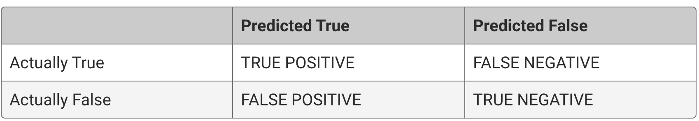
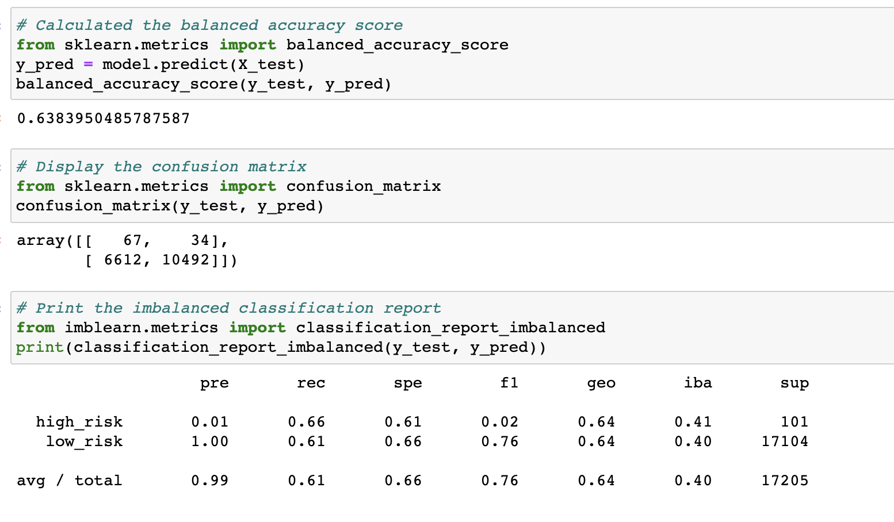
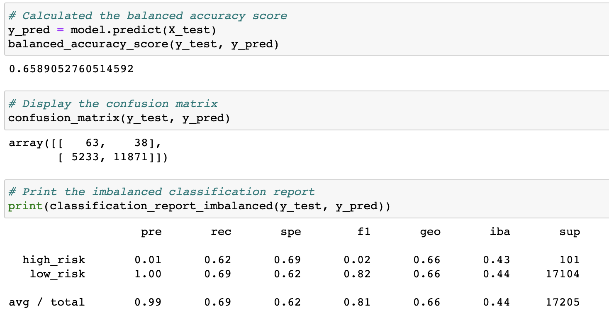
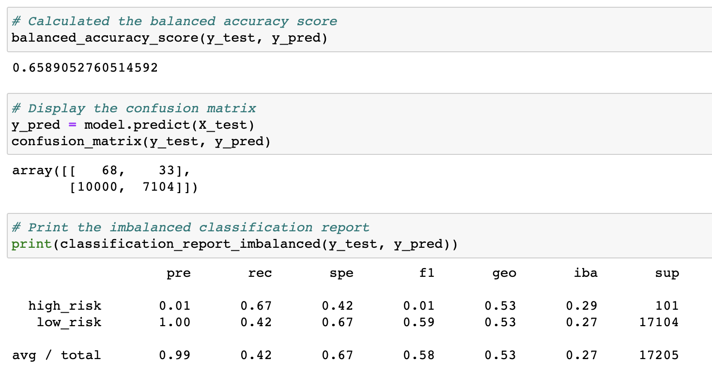
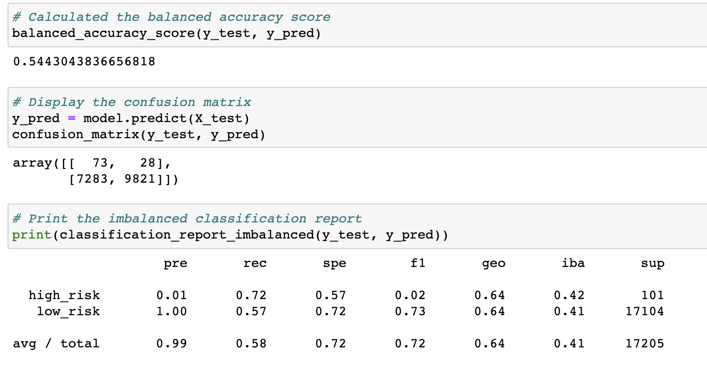
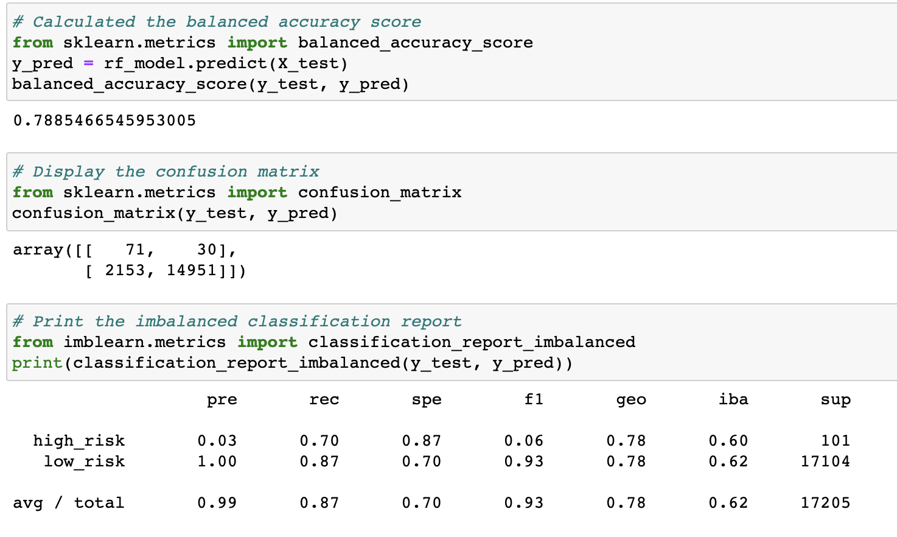
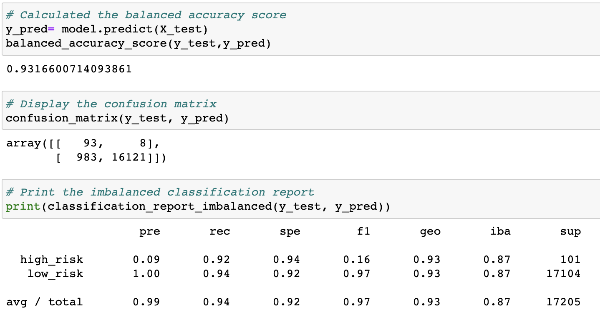

# Credit_Risk_Analysis

## Overview of the analysis:

The purpose of this analysis is to use different machine learning techniques to evaluate credit risk.
Being able to predict credit risk with machine learning algorithms can help predict anomalies, reduce risk cases, monitor portfolios, and provide recommendations on what to do in cases of fraud.

## Results :

### Accurary, Precision, Recall and F1 score:

#### Accuracy

Accuracy is the fraction of the predictions made by different models that were correct.

Accuracy = (TP + TN) / (TP + TN + FP + FN)

#### True Positive (TP) 
When a transaction is predicted to be fraudulent and is really a fraudulent transaction.

#### False Positive (FP) 
When a transaction is predicted to be fraudulent and is not a fraudulent transaction.

#### False Negative (FN) 
When a transaction is predicted to be non-fraudulent and is really a fraudulent transaction.

#### True Negative (TN) 
When a transaction is predicted to be non-fraudulent and is reality is a non-fraudulent transaction.

#### Precision

Precision = TP / (TP + FP)

*Precision* is the ration of correctly predicted *positve* observations to the total predicted positive observations.
Precision attempts to answer, what portion of postive identifications were actually correct.

#### Recall (Sensitivity)

Recall = TP / (TP + FN)

*Recall* is the ratio of correctly predicted *postive* observations to the total positive observations.
Recall attempts to answer, what portion of actual positives were identified correctly.

#### F1 Score 

F1 score = 2 * ( Precision * Sensitivity) / (Precision + Sensitivity)

### Machine Learning Models :

#### 1. Random Oversampling 

Balanced accuracy score is 64%.
The high_risk precision is 1% and Sensitivity is 62%.
The low_risk precision is 100% and Sensitivity is 68%.

#### 2. SMOTE Oversampling

Balanced accuracy score is 66%.
The high_risk precision is 1% and Sensitivity is 62%.
The low_risk precision is 100% and Sensitivity is 69%.

#### 3. Cluster Centroids (Undersampling)

Balanced accuracy score is 66%.
The high_risk precision is 1% and Sensitivity is 67%.
The low_risk precision is 100% and Sensitivity is low 42% due to high number of false positives.

#### 4. SMOTEENN

Balanced accuracy score is 54%.
The high_risk precision is 1% and Sensitivity is 72%.
The low_risk precision is 100% and Sensitivity is low 57% due to high number of false positives.

#### 5. Balaned Random Forest Classifier

Balanced accuracy score is 79%.
The high_risk precision is 3% and Sensitivity is 70%.
The low_risk precision is 100% and Sensitivity is high 87% due to low number of false positives.

#### 6. Easy Ensemble AdaBoost Classifier

Balanced accuracy score is 93%.
The high_risk precision is 9% and Sensitivity is 92%.
The low_risk precision is 100% and Sensitivity is very high 94% due to low number of false positives.

## Summary :

* The accuracy scores of the first four models(oversampling, undersampling and combination) are very low compared to the last two Ensemble models.
* The high risk precision are very low in all the models.
* The low risk precision is 100% in all the models due to high numbers.
* The low risk prediction is better in the Ensemble models.

I would recommend Ensemble models top be used out of all the 6 models.
However none of the models could precisely predict high risk predictions. Low risk prediction are also falsely predicted as 100% in all the cases. None of the models are good enough to be recommendation.

